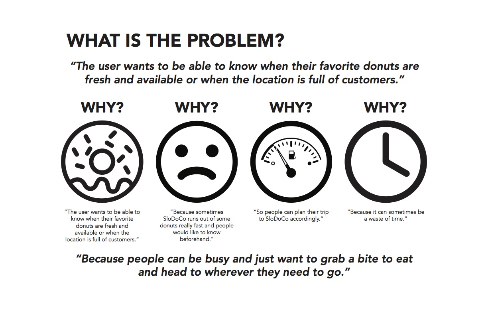

Pefecting the donut consumption experience for busy people on the go.

# Role
I was involved in designing an impactful mobile app experience for SLO Donut Co, a popular donut shop located less than two miles from Cal Poly’s campus.

# Collaborators

+ [Reginald Lata](https://www.linkedin.com/in/reginaldlata/) - UX Designer
+ [Jenna Iarocci](https://www.linkedin.com/in/jenna-iarocci/) - UX Designer
+ [Amber Beckley]() - UX Designer

# Context

SLODOCO brings in about $200,000 of revenue every month. It comes to no surprise that this business knows how to attract people and has built a very successful business because of that. 

# Problem

During peak hours, it is not uncommon to see people waiting in lines out the door for as long as an hour just to order a single donut. Because of this demand, popular donuts often sell out quickly. To the consumer, it is a waste of effort and time. In this interaction, there is both a tangible and intangible cost to their business. 

# Preface
Before starting the design process, it is important to realize the interactions between a business and its customers. Without this, we are not designing with the users in mind.

# Understanding their business
By interacting with managers, employees, and customers of SLODOCO, here are reoccuring observations:
+ SLODOCO makes the most amount of money from tourists, locals, and college students
+ SLODOCO looks to make the entire experience of buying a donut as effortless as possible
+ Socializing with others improves the experience

# Research 

*Note: To comply with non-disclosure, I have omitted and obfuscated confidential information.*

In attempting to discover more about our users, our research stage took the form of assessing usability of current site, interviewing users, creating a survey, and having users participate in a card sort.

## Usability of Current Site

Common Observations Across Two Different Usability Accessments:
+ Users attempt to click on logo when trying to nagivate home
+ Users attempt to click on donuts
+ Users didn't know that custom orders were possible

## Interviewing Users
Based on where SLODOCO makes the most revenue, it would make the most sense to interview someone from every customer segment. In order to get data that is representative of the population, qualitative data will be collected at different times throughout the day. 

Before asking participants questions, we had them do a three minute priming activity to write or draw anything regarding donuts. After they finish, they would asked about what they created and for what reasons.

From talking to two participants, we affirmed our beliefs:
+ SLODOCO’s target demographic does not like to spend time waiting in line
+ This demographic is typically health-conscious and community-oriented
+ Customers of SLODOCO don’t regularly eat donuts
+ Enjoy the social experience that comes with a brand. 

## Survey

When we interviewed the manager of SLODOCO for our Business Canvas Model, they explained how focusing on tourists would
be beneficial for our research as it would gather many different perspectives. SLODOCO also is aiming to expand their customer base, and tourists are a perfect group to spread the word about the business. 

Because of these reasons, we felt it would be effective to focus on tourists for this survey. However, we made sure to write the survey questions in such a way that the survey could be taken by all focus groups in the future.

The survey proved to give us much insight on customer behaviors overall. The survey answers allude to the fact that it would be beneficial to create an app or mobile game for SLODOCO.

## Card Sort

The user is given a set of cards and the user will try to sort cards with different donuts and activies into time categories that fit the best (Morning, Afternoon, Night, Late-night, Anytime).

In terms of responses, we were able to figure out which donuts are prefered during each time of day. The regular donuts are mostly wanted in the morning or at anytime, specialty donuts are wanted more in the afternoon, and the dessert donuts are preferred either at night or late-night.

# Information Architecture

# Affinity Map

# Personas

# Scenarios

Two different scenarios.

## Loyalty + Coupon Scenario

Clare Smith is a single mother of three in her thirties who is a
San Luis Obispo local. She and her children love SloDoCo and
she often treats the family to donuts every Friday after school.
Clare usually does not like to spend money, however she finds
it is worth it to spend this money every week. Clare recently
downloaded the SloDoCo app and was surprised to see that
it had a section that offers coupons and deals. She also was
delighted to find that there was a loyalty program within the
app. The first Friday after downloading the app, Clare opens it
on her cell phone while she is waiting for her children to decide
on what to order. She then taps on the Deals tab and looks
for the best option to use with her order. Next, she tells the
employee her order and finally shows the coupon at the register.
Clare was happy that the coupon gave her a 10% discount. She
then taps on the Loyalty Program tab in the app and shows the
cashier her digital loyalty card. Clare loves this feature because
she frequents SloDoCo every week, and the card allows her to
receive a free item after purchasing six items. Finally, Clare leaves
the establishment with her children in a happy mood due to the
coupon saving her money and the loyalty program promising a
free item in the future

## Donut Availability + Store Occupancy

Jeff Campbell is a Junior Architecture student at Cal Poly
University. It is a late weeknight and he is starting to get a craving
for something sweet to eat. SloDoCo is one of his guilty pleasures
that he lets himself indulge in every so often. His absolute favorite
donut that he always gets at SloDoCo is the glazed buttermilk
donut. Nothing would bring him more joy than to go to SloDoCo
and grab one of these donuts to eat. However it is almost 12 am
and he’s worried they have run out of them. Jeff remembers he
has the SloDoCo app! He remembers that the app will allow him
to see if his favorite donut is currently in stock and will let him see
if he would have to wait in line for it. So he pulls out her phone
and opens the app. Sure enough, his hunch was correct. A bar
on the app indicated that it’s a full house due to an event and all
the donuts were gone and he now has to wait for fresh donuts.
He decides to wait and spends the rest of the time studying and
catching up on work. Then Jeff receives a notification that the
donuts are ready and he sees that the store is no longer packed.
So he heads for the shop and grabs his donut and continues to
be a happy customer.

# Storyboard

# Prototype

# Usability Study

Filler content of what is actually going to be said. 

## Usability Study Changes

