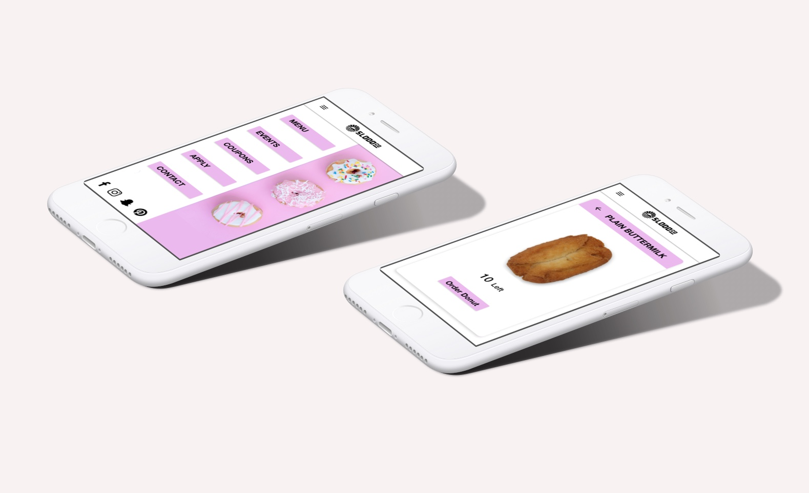

# Summary
SLO Donut Co. is a successful local donut shop that has problems with wait times during peak times. In this project, the goal was to make it easier for users on the go to order donuts online. 

# Prototype
`youtube: s7HTmnnUYTo`

# Role
I was involved in designing an impactful mobile app experience for SLO Donut Co, a popular donut shop located less than two miles from Cal Poly’s campus.

# Collaborators

+ [Reginald Lata](https://www.linkedin.com/in/reginaldlata/) - UX Designer
+ [Jenna Iarocci](https://www.linkedin.com/in/jenna-iarocci/) - UX Designer
+ [Amber Beckley]() - UX Designer

# Problem

During peak times, it is not uncommon to see people waiting in lines out the door to order a single donut. To the consumer, it is a waste of effort and time to wait for donuts that may or may not sell out. In this interaction, there is both a tangible and intangible cost to their business. 

# About the business

Before starting the design process, it is important to realize the interactions between a business and its customers.

# Summary of business model canvas
+ SLODOCO get their sales from tourists, locals, and college students
+ SLODOCO looks to make the entire experience of buying a donut as effortless as possible

# Research 

*Note: To comply with non-disclosure, I have omitted and obfuscated confidential information.*

In attempting to discover more about our users, our research stage took the form of assessing the usability of the current site, interviewing users, creating a survey, and having users participate in a card sort.

## Usability testing current side

Common Observations Across Two Different Usability Assessments:
+ Users attempt to click on the logo when trying to navigate home
+ Users attempt to click on donuts
+ Users didn't know that custom orders were possible

## Interviewing Users
I started with a small priming activity regarding donuts. Then, I asked them questions regarding the consumption of donuts. 

### Summary of Findings
+ No one likes waiting in lines
+ The target demographic is typically health-conscious and community-oriented
+ Customers of SLODOCO don’t regularly eat donuts
+ Customers enjoy the social experience that comes with buying a donut 

## Survey
When I interviewed the manager of SLODOCO for our Business Canvas Model, they explained how focusing on tourists would be beneficial for our research as it would gather many different perspectives. SLODOCO also is aiming to expand its customer base, and tourists are a perfect group to spread the word about the business. 

Because of these reasons, I felt it would be effective to focus on tourists for this survey. However, I made sure to write the survey questions in such a way that the survey could be taken by all focus groups in the future.

The survey proved to give us much insight into customer behaviors overall. The survey answers allude to the fact that it would be beneficial to create an app or mobile game for SLODOCO.

## Card Sort

The user is given a set of cards and the user will try to sort cards with different donuts and activities into time categories that fit the best (Morning, Afternoon, Night, Late-night, Anytime).

In terms of responses, I was able to figure out which donuts are preferred during each time of day. The regular donuts are wanted anytime, specialty donuts are wanted in the afternoon, and the dessert donuts are preferred either at night.

# Information Architecture

Based on the research, I tried to understand more closely how the old site information was being organized. In this exercise, I realized the hierarchy does not always make sense to the user. 

Most users according to our personas aren't looking to apply to work there or are looking at ordering custom donuts. While deals do logically make sense in its current place, our users would prefer that to be in its section because of the frequency that users are looking for deals. 

# Affinity Map

We had a hard time understanding how to group items in the information architecture, pointing to the lack of organized structure on the site. We did such because of trying to organize our ideas and finding new ways to accomplish structure. 

# Personas

From discovering various traits found in typical users, we decided that using multiple personas would be a valuable trade-off when it comes to the flexibility of the app and site. 

# Scenarios

Based on the personas we created, we used that information to guide goals that users have.

## Clare and Loyalty/Coupon

+ Clare Smith love SLODOCO and often treats the family to donuts every Friday after school.
+ Clare recently downloaded the SloDoCo app and was surprised to see that it contained offers and coupons as well as a loyalty program. 
+ Clare opens it on her cell phone while she is waiting for her children to decide on what to order. 
+ She then taps on the Deals tab and looks for the best option to use with her order. 
+ When arriving, Clare was happy that the coupon gave her a 10% discount. 
+ Clare then taps on the Loyalty Program tab in the app and shows the cashier her digital loyalty card.
+ Clare leaves the establishment in a happy mood 

## Jeff and Donut Availability

+ Jeff Campbell is working in architecture studio on a late weeknight and he is starting to get a craving for something sweet.
+ Jeff is craving SLODOCO as it is one of his guilty pleasures, but is unsure if his favorite donut is in stock. 
+ Jeff opens the SLODOOCO app, realizes that SLODOCO is all out.
+ Jeff can see that a new batch will be ready soon.
+ Jeff receives a notification that the donuts are ready
+ Jeff heads to the shop, chats with the cashier, and goes back to continue working on his school project.

# Storyboard

# Prototype

# Usability Study

This prototype was made in Balsamiq to test some tasks that would be performed by our personas. 

1. How many Strawberry French Crullers are available?
2. SloDoCo has just sent you notifications about coupons, how would you be able to redeem your custom order coupon?

## Most important changes for the next iteration

+ Consider the use of deals compared to coupons
+ Allow users to tap on entire boxes rather than just the button
+ Be more conscious about chunking for users who are overwhelmed with choices

## Visual Language Suggestions

Based on the colors from within the store and their current brand that they have developed, there was an emphasis on trying to stay uniform to that voice and understanding how to adapt what currently exists for a mobile app.

# Lessons learned
+ It is easy to invalidate bad research
+ Research can change over time to better reflect users
+ Design for user's goals, not tasks