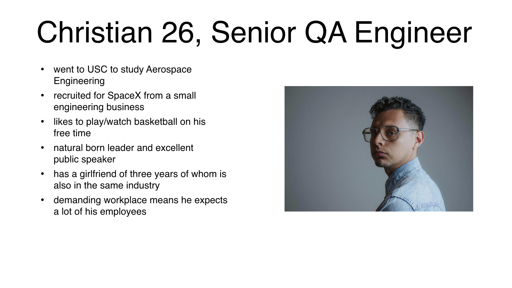
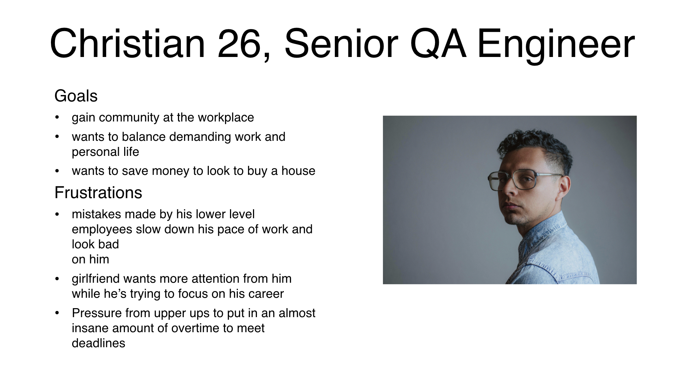
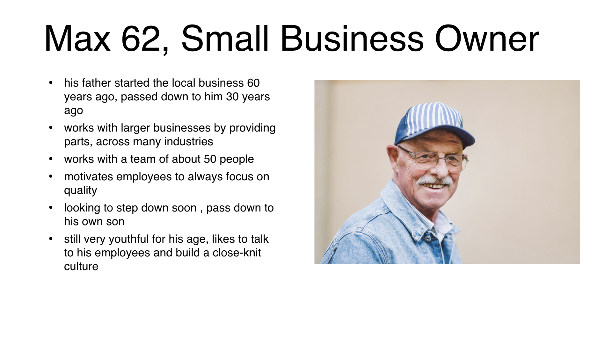
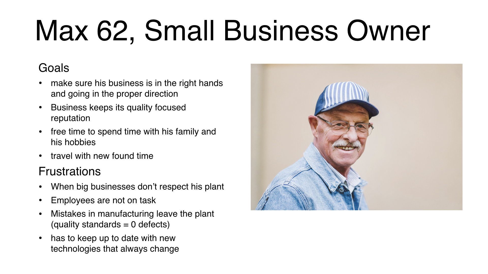
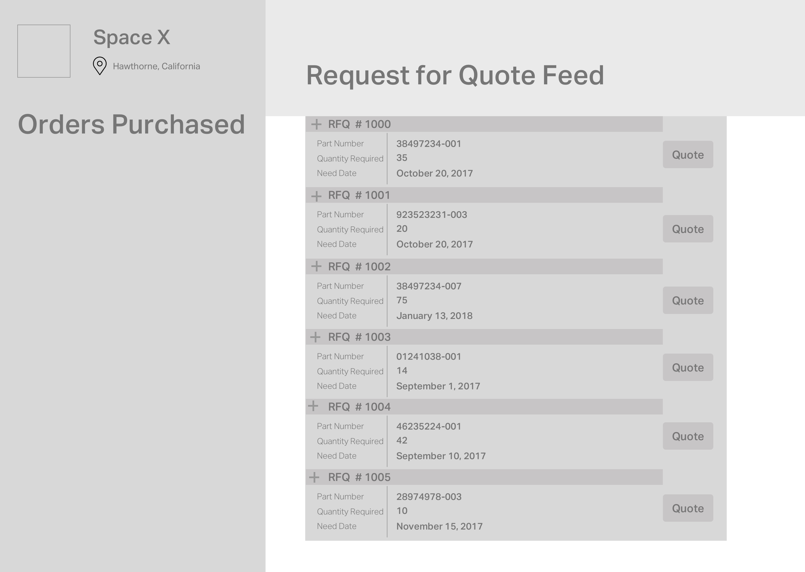
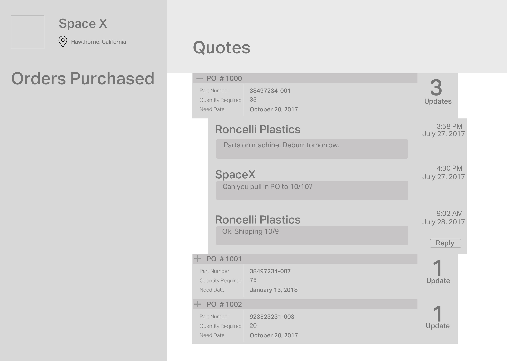
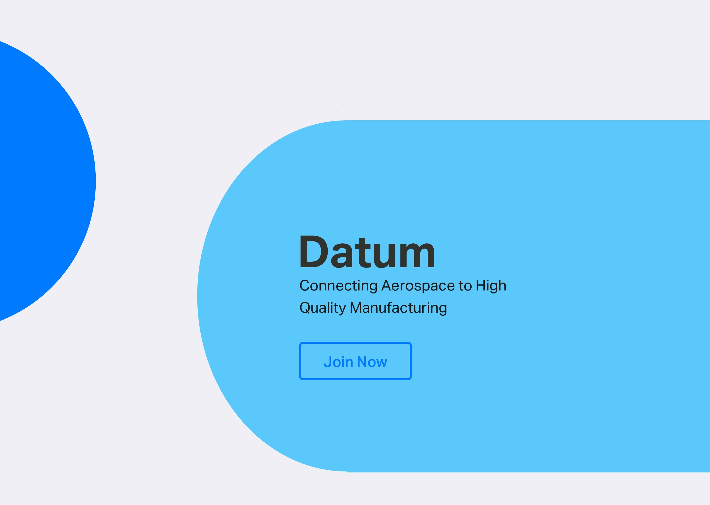
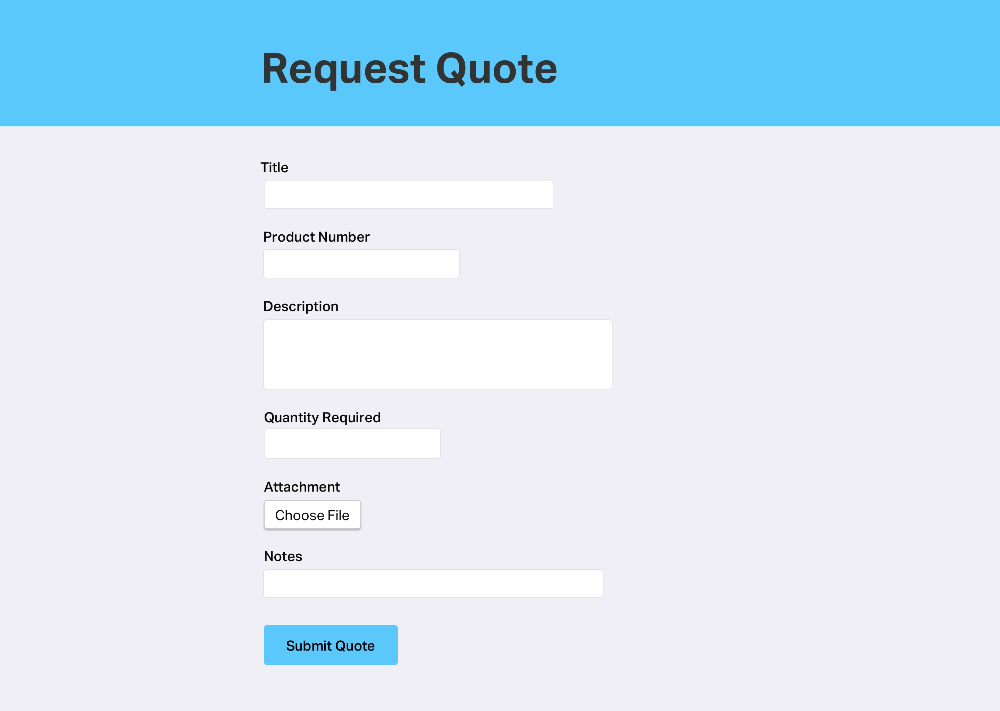
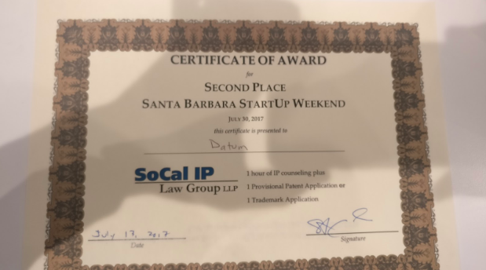

(Start-up Weekend Santa Barbara) Connecting the aerospace industry to high quality manufactoring of the 21st century. 

# Role
Throughout this project, I was the team's only designer and took most responsibilies from research, experience design, and visual design.

# Collaborators 

+ [Colin McGuire](https://www.linkedin.com/in/colinjmcguire/?lipi=urn%3Ali%3Apage%3Ad_flagship3_search_srp_people%3Brtlo2E7gT4WcVHPRCEJSIg%3D%3D&licu=urn%3Ali%3Acontrol%3Ad_flagship3_search_srp_people-search_srp_result&lici=ptXWx1%2F0SByVJplxQI8uCQ%3D%3D) - Space X Engineer and Founder
+ [Diego Satkofsky](https://www.linkedin.com/in/diego-satkofsky-686321109/?lipi=urn%3Ali%3Apage%3Ad_flagship3_search_srp_people%3Bf%2BLCagQ2Q%2Bejt9I%2F5QGljw%3D%3D&licu=urn%3Ali%3Acontrol%3Ad_flagship3_search_srp_people-search_srp_result&lici=1A9xi7swTCesMPHFfyGAeA%3D%3D) - Financial Analyst
+ [Forrest VanderBorgh](https://www.linkedin.com/in/forrest-vanderborgh-73004b59/?lipi=urn%3Ali%3Apage%3Ad_flagship3_search_srp_people%3BJzh1M%2FmER9%2BH%2F1mUlyiSdA%3D%3D&licu=urn%3Ali%3Acontrol%3Ad_flagship3_search_srp_people-search_srp_result&lici=iFQHhl0YSYaZ2M%2Bw5VepLA%3D%3D) - Software Developer
+ [Nicolas Paige](https://www.linkedin.com/in/nicolas-paige-300566a8/?lipi=urn%3Ali%3Apage%3Ad_flagship3_feed%3BE2ZJiSXpRayQXdMgij6RvA%3D%3D&licu=urn%3Ali%3Acontrol%3Ad_flagship3_feed-search_srp_result&lici=CnRbflW2RXaAmRDWgylexw%3D%3D) - Marketing Director
+ [Mark Weeks](https://www.linkedin.com/in/markweeks/?lipi=urn%3Ali%3Apage%3Ad_flagship3_search_srp_people%3BJ%2Fv%2BsupgTciGK7mfGin0AA%3D%3D&licu=urn%3Ali%3Acontrol%3Ad_flagship3_search_srp_people-search_srp_result&lici=kh7MuybcSJiNH8W66wHD%2FQ%3D%3D) - Product Manager

# Context

SpaceX’s Falcon 9 is a prime example of how [one faulty part led to total loss of spacecraft](https://www.bbc.com/news/science-environment-33305083). Organizations like SpaceX, JPL, and Boeing have issues with having access to parts that are in conformance to perfect manufacturing. The most common method for vetting suppliers is to cold call them and try to organize this information internally.  

# Problem 
In the aerospace industry, part malfunctions are a serious problem and companies don't like dealing this keeping information about suppliers internally. Many companies would rather focus on engineering work than managing their connections. Datum is attempting to create a funnel for building a relationship between suppliers and aerospace businesses. 

# Competitive Analysis 
From our research, there are no direct competors to this product. The only competition are aerospace businesses that manage such information internally. 

# Personas

# Wireframe

# Visual Language

# Second Place! 

