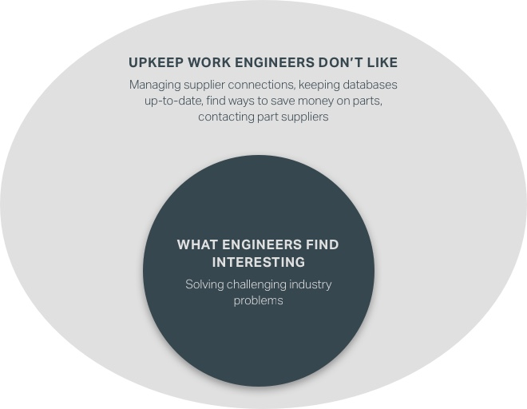
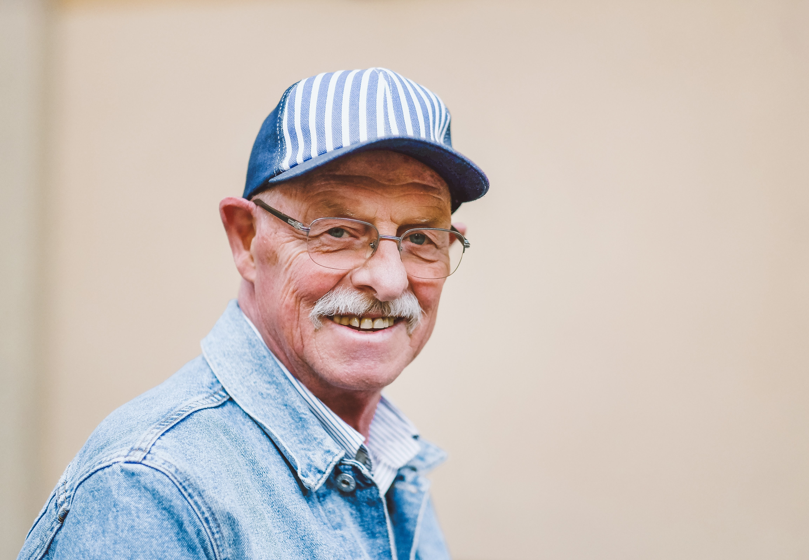

<!-- end -->

# Role
Throughout this project, I was the team's only designer and took most responsibilities from research, experience design, and visual design.

# Collaborators 

+ [Colin McGuire](https://www.linkedin.com/in/colinjmcguire/?lipi=urn%3Ali%3Apage%3Ad_flagship3_search_srp_people%3Brtlo2E7gT4WcVHPRCEJSIg%3D%3D&licu=urn%3Ali%3Acontrol%3Ad_flagship3_search_srp_people-search_srp_result&lici=ptXWx1%2F0SByVJplxQI8uCQ%3D%3D) - SpaceX Engineer and Founder
+ [Diego Satkofsky](https://www.linkedin.com/in/diego-satkofsky-686321109/?lipi=urn%3Ali%3Apage%3Ad_flagship3_search_srp_people%3Bf%2BLCagQ2Q%2Bejt9I%2F5QGljw%3D%3D&licu=urn%3Ali%3Acontrol%3Ad_flagship3_search_srp_people-search_srp_result&lici=1A9xi7swTCesMPHFfyGAeA%3D%3D) - Financial Analyst
+ [Forrest VanderBorgh](https://www.linkedin.com/in/forrest-vanderborgh-73004b59/?lipi=urn%3Ali%3Apage%3Ad_flagship3_search_srp_people%3BJzh1M%2FmER9%2BH%2F1mUlyiSdA%3D%3D&licu=urn%3Ali%3Acontrol%3Ad_flagship3_search_srp_people-search_srp_result&lici=iFQHhl0YSYaZ2M%2Bw5VepLA%3D%3D) - Software Developer
+ [Nicolas Paige](https://www.linkedin.com/in/nicolas-paige-300566a8/?lipi=urn%3Ali%3Apage%3Ad_flagship3_feed%3BE2ZJiSXpRayQXdMgij6RvA%3D%3D&licu=urn%3Ali%3Acontrol%3Ad_flagship3_feed-search_srp_result&lici=CnRbflW2RXaAmRDWgylexw%3D%3D) - Marketing Director
+ [Mark Weeks](https://www.linkedin.com/in/markweeks/?lipi=urn%3Ali%3Apage%3Ad_flagship3_search_srp_people%3BJ%2Fv%2BsupgTciGK7mfGin0AA%3D%3D&licu=urn%3Ali%3Acontrol%3Ad_flagship3_search_srp_people-search_srp_result&lici=kh7MuybcSJiNH8W66wHD%2FQ%3D%3D) - Product Manager

# Context

SpaceX’s Falcon 9 is a prime example of how [one faulty part led to total loss of spacecraft](https://www.bbc.com/news/science-environment-33305083). Organizations like SpaceX, JPL, and Boeing have issues receiving quality parts from suppliers. 

In this context, quality is defined as a system that works as intended, but is limited by how reliable the least quality part is. For example, the quality of the Falcon 9 aircraft is limited by the part that failed during takeoff. 

# Problem 

In the aerospace industry, part malfunctions are a serious problem and companies don't like dealing this keeping information about suppliers internally. Many companies would rather focus on engineering work than managing their connections. Datum is attempting to create a funnel for building a relationship between suppliers and aerospace businesses.

# Competitive Analysis 
From our research, a lot of places offer directories of top manufactorers. However, aerospace businesses have to manage and sort such information internally. From talking to mentors during the start-up event and looking online, there has been no attempt make a viable business.

# Research

*Note: To follow non-disclosure agreement, I have omitted and obfuscated confidential information.*

From talking to members of our team and reaching out to mentors during the competition, we found a list of engineers and contacts from a wide set of backgrounds to talk to potential users. We asked the following questions to engineers.

* What is your main role as an employee of where you work?
* How do you get into contact with part suppliers?
* How does one build relations with part suppliers?

From talking to engineers within the industry, we discovered that the most common method for vetting suppliers is to cold call them. The next common method is to rely on existing relationships. From this phase, these points were brought up.

1. Adhering to quality conditions is only done so internally.
2. Our model needs to find a way to attract good part suppliers in order to generate a sustainable environment for businesses looking for different part options.

From this point, we have only designed for businesses. It became clear that we needed to involve both businesses and service providers. 

# Personas

## “I'm looking to show others that I'm a leader.”

Christian is a 28-year-old Senior quality assurance engineer who was recruited after working in a smaller local business near his hometown of Van Nuys, California. He likes to work in a fast paced environment and expects a lot from others. While being self-motivated, Christian doesn't like that he feels overly-pressured from upper ups to put in overtime in order to meet deadlines.

### Christian's goals
+ Wants to balance demanding work and personal life
+ Wants to save money and look to buy a house with his newly-wed spouse
+ Feels pressuered from upper ups to put in overtime to meet deadlines

## “Everything that leaves the plant must be our best work.”

Max is a 62-year-old small part supplier owner who has been running family business for 30 years. The business has been passed down various generations. Max is very youthful and energetic and likes to build close relationships with his employees. Max's small shop provides parts across various industries and works with a team of about 25 people. Max is frustrated when big business overlooks his plant. He doesn't like when employees aren't on task, especially when it can affect quality metrics.  

### Max's goals
+ Make sure his business is in the right hands and moving in the proper direction
+ Make time to build connections with family and employees
+ Keep business' reputation as being reliable

# Wireframe

# Visual Language

# Second Place! 

