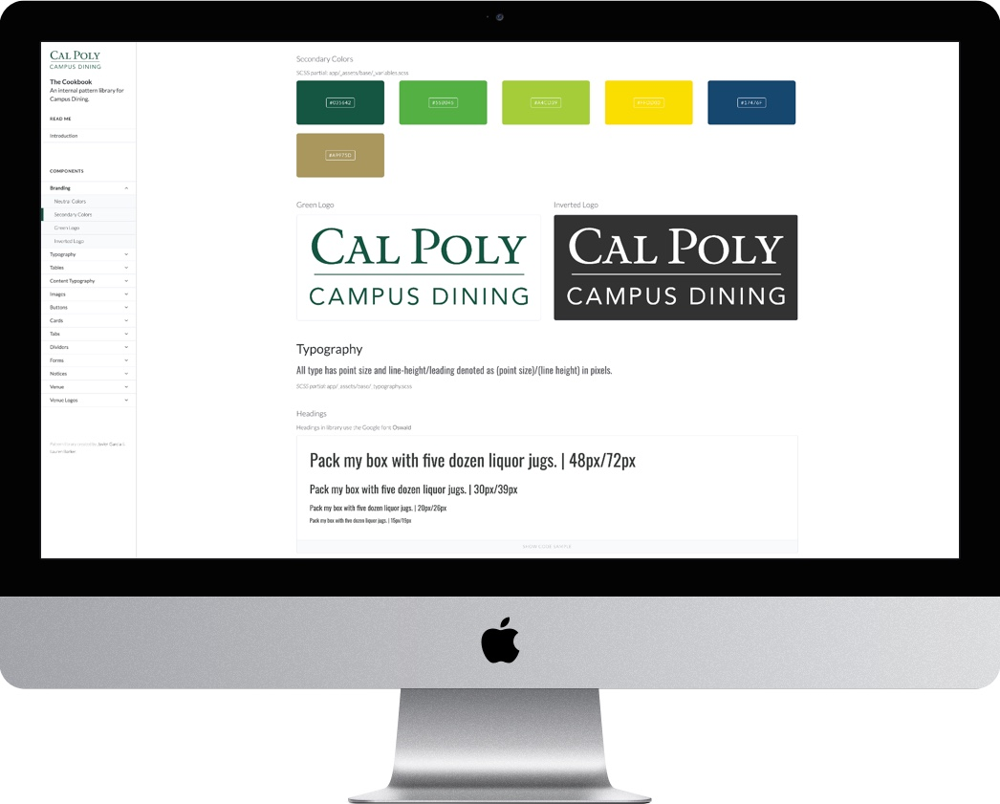
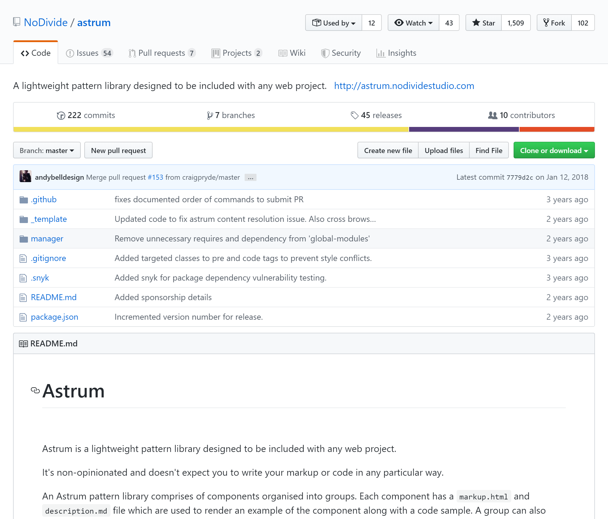

<!-- end -->

# Problem
When working on a content driven website that required daily changes, there was lacking documentation among developers and nondevelopers alike. This led an effort to improve our internal documentation. 

<a href="https://www.calpolydining.com/cookbook" target="_blank">Check out the site here.</a>

# Role
I was the the web developer that was starting to take design responsibilities.

+ [Lauren Barker](https://www.linkedin.com/in/weblbdesigns/) - Full Stack Developer
+ [Carlos Paz]() – Student Developer
+ [Tyler Ratchod]() - Student Developer

# Exploration into existing solutions
With a small development team, we had to consider to perks of making our own solution. We went the direction of exploring into existing solutions as it would have minimal upfront development.

## Concerns
1. We want to see all of our styles and patterns in one place, quickly revealing maintenance issues.
2. Solution would need to work out of the box without custom configuration
3. No bells and whistles. Just a light platform with everything that we need. 

## Astrum
From looking into open-source lightweight and configurable solution to our problem, we landed upon using [Astrum](https://github.com/NoDivide/astrum). We then branded the site and filled it with our existing components. 

# Uncovered efforts from working on the Cookbook
  
## Increasing web browser support
As a decent percentage of users are viewing the site with older browsers, we wanted to improve Internet Explorer 10+ support. This led an effort to improve certain styles for card components. 

 
## Server issue states 
I worked on designing and developing a static page that would show if the dining site would not be able to be served due to server errors. Rather than receiving a 500 error page, users would see this page instead.
 
 

## Form submit microinteraction
In looking to extend the work within forms, we wanted to explore potential interactions when submitting any form across the dining site. The inspiration behind this was a [dribble confirm button animation](https://dribbble.com/shots/6538291-Confirm-button-animation).

# Moving Forward

Under construction...