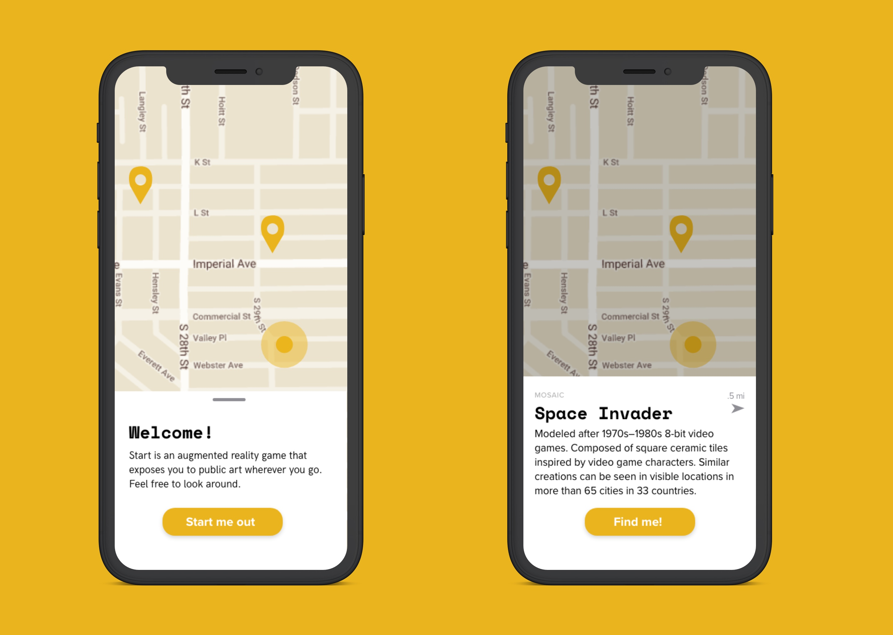
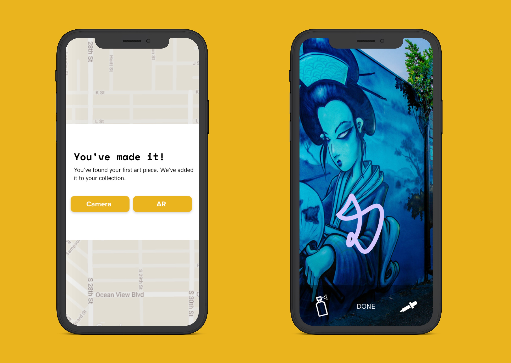
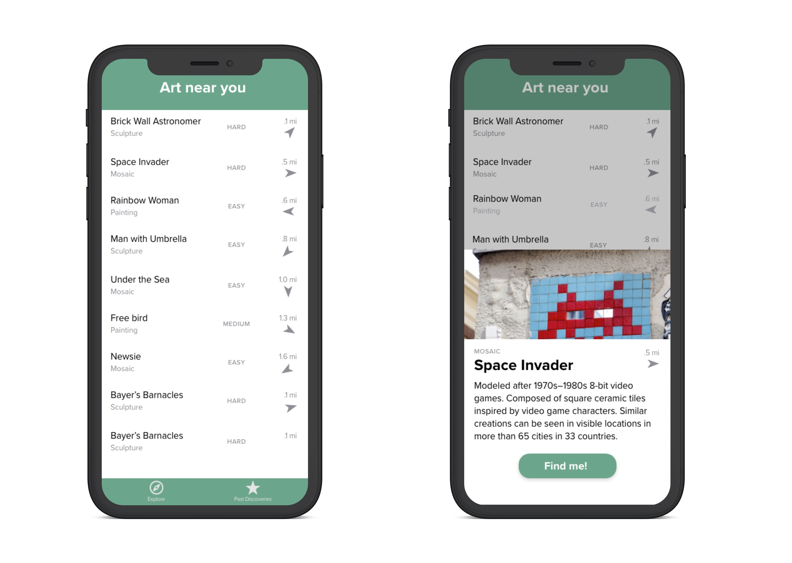
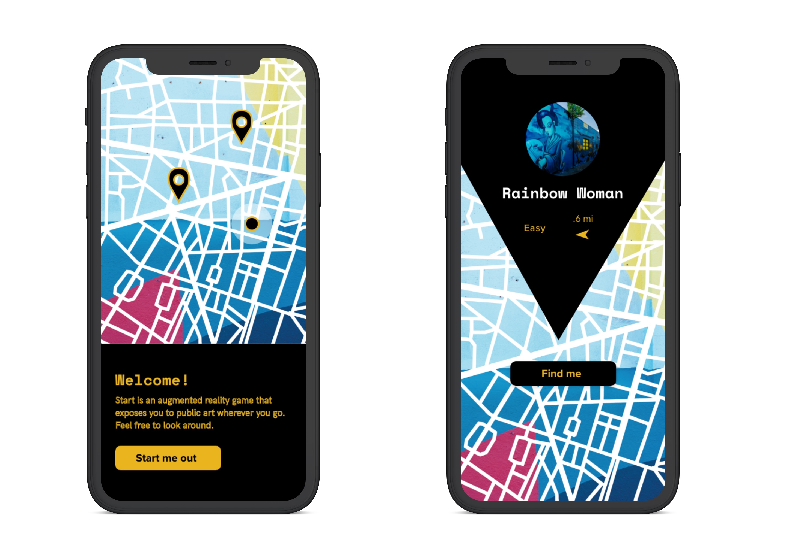

# Situation
For a Mobile UX Design course, I was tasked with designing a mobile application that involved an emerging technology. Our end product is an app to promote the celebration of culture and spirit of artistry. We achieved this by connecting travelers to local street art. 

## Roles
In this project, I  collaborated with [Anna Shambaugh](https://www.linkedin.com/in/anna-shambaugh/?lipi=urn%3Ali%3Apage%3Ad_flagship3_search_srp_top%3BDHyLxgxGQlKAmE3smEDQJw%3D%3D&licu=urn%3Ali%3Acontrol%3Ad_flagship3_search_srp_top-search_srp_result&lici=hEqIYOcPSP%2Bx23GMhJUXaQ%3D%3D) in research and ideation. I took charge in interaction and visual design as I had more experience.

# Objective
Most tourists characterize London with its iconic city space. However, locals see London from a very different point of view.

## Problem

"Tourist traps" currently concentrate tourism foot traffic and spending within small areas. This can negatively affect the local community and lead to a set of unintended consequences. 

## Goals
+ Decrease disconnect between tourism and local life
+ Encourage travelers to be environmentally and socially conscious during travel

## Solution  

No matter what end product was created, it became important to preserve the spirit of travel. To us, tourism became important because of exploration and immersion. To understand and capture human expression means learning to grow to understand others.

# Action

## Structured Interviews

*Note: To follow non-disclosure agreement, I have omitted and obfuscated confidential information.*

I asked the following questions to five different individuals about their travels. We wanted to confirm that travelers often overlook destinations that locals congregate behind. 

### Synthesis

+ Participants agree that spending too much time around tourist destinations can feel fake
+ Participants take tremendous pride in their community
+ Participants claim to want a mix of tourism and non-tourist destinations

## “I’m missing out on the authentic culture of the places I travel.” —Jeremy

### Jeremy's goals
+ Become more cultured by exploring new places
+ Meet new kinds of people 
+ Share his experience within his close friends

## Desired Outcomes
+ Minimize boredom while traveling
+ Increase the number of "real" places visited
+ Keep track of the destinations traveled

### Initial Sketches

### Wireframe

## Usability testing
We asked four different users to complete three different tasks. One of the three tasks was confusing to users. This was based on our misconception that users [ don't like to scroll](https://uxmyths.com/post/654047943/myth-people-dont-scroll). 

Or changes was to make this screen default to sort by date. From testing our third task again, our users were able to finish the task.

### Visual language suggestions

Direction 1

Direction 2

 Material Design and Pokémon Go inspired both directions. Material Design has a far reach that many users have come across. Pokemon Go is in a similar domain of augmented reality.

# Results 

## First round of changes
From both iterations, we wanted to be more expressive as the app must resonate with people who are fans of art. This can be difficult when trying to also follow common design patterns elsewhere. 

## Decided Language

# Aftermath

## Future iterations
In future versions, users should be able to see other user’s photos and tags within AR. It would also be important to have artists being more involved with adding their art to the app.

## Ethical considerations
1. Artist may feel that our app violates their usage rights as the creator of an image. An artist should have a say whether their work gets displayed on the app. 
2. We have to consider what would happen to communities that don't want people in their space. 
3. How would we go about monitoring ”inappropriate” art without trying to censor different perspectives? This is an important question that needs lots of consideration.

## Technical limitations
How can we people be able to interact with doodles made by others? At the time of the project, Apple's ARKit can support the app as designed, but Android devices need further development.