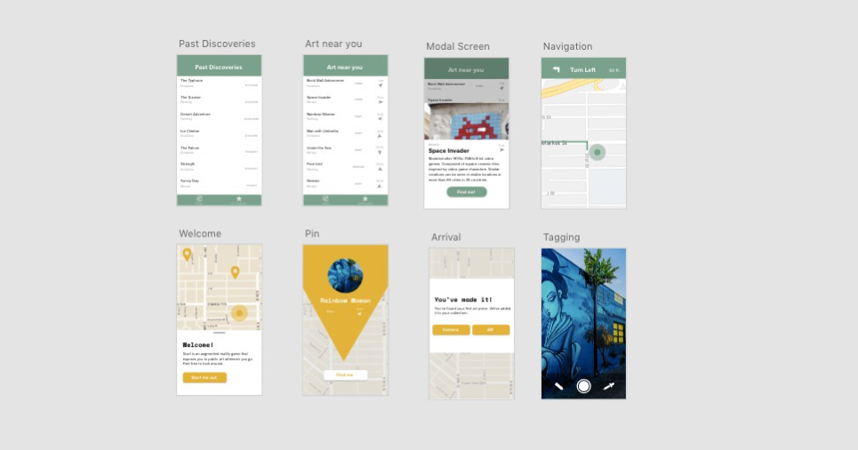

#### insert mockup here

# Situation

 For a Mobile UX Design course, I was tasked with designing a mobile application that involved an emerging technology. Our end product was an app to promote the celeration of culture and spirit of artistry. We achieved this by connecting travelers to local street art. 

## Roles

In this project, we collaborated in research and ideation. I took charge in interaction and visual design as I had more experience.

Javier Garcia – UX Designer

[Anna Shambaugh](https://www.linkedin.com/in/anna-shambaugh/?lipi=urn%3Ali%3Apage%3Ad_flagship3_search_srp_top%3BDHyLxgxGQlKAmE3smEDQJw%3D%3D&licu=urn%3Ali%3Acontrol%3Ad_flagship3_search_srp_top-search_srp_result&lici=hEqIYOcPSP%2Bx23GMhJUXaQ%3D%3D) - UX Designer

# Objective

  
## Problem — Disconnect between tourism and local life

"Tourist traps" currently concentrate tourism foot traffic and spending within small areas. This can negatively affect the local community and lead to a set of unintended consequences. 

This image shows the city of London from two different points of view. Both of these images show how vastly different tourists envision London in comparison to locals. We want to show tourists the experience of living in cities that they visit. 

## Goals
+ Decrease disconnect between tourism and local life
+ Encourage travelers to be environmentally and socially conscious during travel

## Street art as a medium

Art reflects the values of the people whom encompass that community. A potential solution to the problem is to make tourism feel more authentic by exploring street art.

# Action

## Structured Interviews

*Note: To follow non-disclosure agreement, I have omitted and obfuscated confidential information.*

We asked the following questions to five different individuals about their travels. We wanted to confirm that travelers often overlook destinations that locals congregate behind. 

### General Findings

+ Spending too much time around tourist destinations can feel fake
+ Humans take tremendous pride in their community
+ Our participants claimed to want a mix of tourism destinations and non-tourist destinations

## “I’m missing out on the authentic culture of the places I travel.”

### Jeremy's goals
+ Become more cultured by exploring new places
+ Meet new kinds of people 
+ Share his experience within his close friends

## Desired Outcomes

+ Minimze boredom while traveling
+ Increase number of "real" places visited
+ Keep track of the destinations traveled

### Initial Sketches

### Wireframes

## Usability testing
We used an [adapted sample script](https://www.sensible.com/downloads/test-script.pdf) to provide consistency between usability testing.  Four different individuals gave feedback to our wireframe. We asked them to complete three different tasks. 

From three usability tests, we could see that our first two tasks of our interface were easy to follow. Yet, our third task was confusing to participants. 

When our participants looked for an item on a list, we expected them to understand pagination. Instead, their natural response was to [scroll and not sort](https://uxmyths.com/post/654047943/myth-people-dont-scroll). 

Or changes was to make this screen default to sort by date. Also, a sort button with a drop-down gives users control of how they want to sort. From testing our third task again, our users were able to finish the task.

### Visual language suggestions
Users spend most of their time on other applications. We can use other existing design patterns to guide our process. Material Design and Pokémon Go inspired the visual language. Material Design has a far reach that many users have come across. Pokemon Go is a similar domain of augmented reality. This process was about adapting what currently exists to StArt. 

# Results 

## First round of changes
From both iterations, we wanted to be more expressive as the app must resonate with people who are fans of art. This can be difficult when trying to also follow common design patterns elsewhere. 

# Aftermath

## Future iterations
In future versions, users should be able to see other user’s photos and tags within AR. It would also be important to have artists being more involved with adding their art to the app.

## Ethical considerations
These are things that we need to keep in mind when pursuing the idea further. The artist may feel that our app violates their usage rights as the creator of an image. An artist should have a say whether their work gets displayed on the app. We also have to consider tourism in areas that don't want tourism. Finally, we should consider monitoring inappropriate art without trying to censor different perspectives. It is also important to consider who gets to say what is inappropriate. 

## ARKit and technical limitations
A challenge is finding a way for others to see tags made on different devices. Currently, Apple's ARKit can support the app as designed. Yet, such a technology is still emerging and needs to develop further across other devices. 

## What I learned

An augmented reality mobile app to learn more about culture and art while traveling.

<!-- end -->

Our app's vision is to promote the celebration of culture and spirit of artistry. We want to connect travelers to local art in an effort to make our world more aware of other's culture.

Any laymen person would be able to tell you in an instant where the subject of the first photograph is. A local from London might tell you that they pass by the second photograph on their morning commute. London is one of the most visited locations in the world with [thirty million annual visitors](http://www.uncsbrp.org/tourism.htm). Yet, only a handful of people could tell you how this mural came to be. 

# Audience

Many comments made was to expand the idea to a travel app that tourists can use when traveling. But, there are other competitors currently successful in that market. Our decision was to limit to scope as we wanted the app to be as focused on a user as possible.

Such individuals find different cultures exciting. They travel often and are looking at experiencing communities different from their own. These individuals can find themselves between large metropolitan areas and small towns.

## free to play

When talking to different people, we faced a challenge of what to include when making the app. A suggestion involved expanding public art to art found in museums.

We decided to keep the app in the direction of public art. By keeping the demographic specific, this allows for flexibility to not compromise usability. It was also important for art to be accessible without payment. From our feedback, we thought art in the public better reflects ideas of an area more so than art in a museum.

