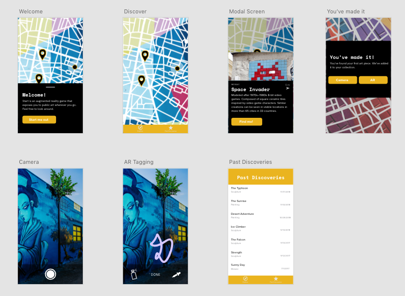

An augmented reality mobile app to learn more about culture and art while traveling.

# Role
I designed an impactful mobile app experience from start to finish. This was a personal project.   

## Collaborators
[Anna Shambaugh](https://www.linkedin.com/in/anna-shambaugh/?lipi=urn%3Ali%3Apage%3Ad_flagship3_search_srp_top%3BDHyLxgxGQlKAmE3smEDQJw%3D%3D&licu=urn%3Ali%3Acontrol%3Ad_flagship3_search_srp_top-search_srp_result&lici=hEqIYOcPSP%2Bx23GMhJUXaQ%3D%3D) - UX Design

# Context

Any laymen person would be able to tell you in an instant where the subject of the first photograph is. A local from London might tell you that they pass by the second photograph on their morning commute. London is one of the most visited locations in the world with [thirty million annual visitors](http://www.uncsbrp.org/tourism.htm). Yet, only a handful of people could tell you how this mural came to be. 

Our app's goal is to promote the celebration of culture and spirit of artistry. The art of a society reflects a lot about the society itself. By allowing others to discover local art, the hope is that other people can be more aware of their own culture.

# Problem

People spend lots of time hovering around “tourist traps” when traveling. As a consequence, tourists can concentrate foot-traffic within areas that negatively affect locals. This is in contrast to travelers who try to understand the area from the point of view of locals. Such travelers are more open to respecting the world around them. 

# Research

*Note: To follow non-disclosure agreement, I have omitted and obfuscated confidential information.*

We asked the following questions to five different individuals about their travels. We wanted to confirm that travelers often overlook destinations that locals congregate behind. 

## Questions 
+ Tell me a little bit about where you’re from.
+ How connected you feel to your local community?
+ What locations that aren't well known to outsiders do you like to visit? 
+ How important is a cultural expression to you?
+ How often do you travel?
+ How much do you plan when you travel?
+ How do you balance local culture and tourist attractions?
+ What do you enjoy about artistic attractions?

From speaking with real people, we discovered these general findings.

+ Spending too much time around tourist destinations can feel constructed
+ Balance of both tourist destinations and non-tourist destinations 
+ People take pride in their community

# Defining public art

When talking to different people, we faced a challenge of what to include when making the app. A suggestion involved expanding public art to art found in museums.

We decided to keep the app in the direction of public art. By keeping the demographic specific, this allows for flexibility to not compromise usability. It was also important for art to be accessible without payment. From our feedback, we thought art in the public better reflects ideas of an area more so than art in a museum.

# Audience

Many comments made was to expand the idea to a travel app that tourists can use when traveling. But, there are other competitors currently successful in that market. Our decision was to limit to scope as we wanted the app to be as focused on a user as possible.

Such individuals find different cultures exciting. They travel often and are looking at experiencing communities different from their own. These individuals can find themselves between large metropolitan areas and small towns.

# Persona

## “I’m missing out on the authentic culture of the places I travel.”

Jeremy Wilkes is a 24-year-old student teacher. He is also a part-time wedding photographer as a way to supplement his income. Jeremy enjoys going on road trips with friends on weekends and during his time off. When he gets the chance he also likes to travel abroad with his family. When Jeremy and his family travel they like to leave some time to do some free-form exploring.

### Jeremy's Goals
+ Learn more about the authentic culture in the places he visits.
+ Wants to meet new kinds of people when he goes on trips.
+ Wants to explore new things in places he hasn't been before
+ Wants to share his experience within his circle of friends and family
+ Wants to keep track of all the places he’s visited.
+ Doesn’t want to spend a lot of money to experience the places he visits

# Scenario

1. Jeremy is in Phoenix, AZ for a photography gig over the weekend.
2. He wants to experience the local culture but not spend any money. 
3. Jeremy pulls out his phone and StArt lists local street art nearby.
4. The map on his phone directs him to art a couple blocks away.
5. Jeremy finds the cool mural of Muhammad Ali, a local resident, on the side of a shop.
6. The app congratulates Jeremy for finding the mural. The app describes the history of the mural.
7. Ali’s impact on the area fascinates Jeremy.
8. Jeremy uses AR to sign his name. He wants to leave his mark without disrespecting the artist.
9. Jeremy notices that the street he’s on has some other interesting displays and shops. Jeremy looks for other nearby art to kill more time.

# Interaction framework
Based on the snenario of Jeremy.

# Wireframes

# Usability testing
We used an [adapted sample script](https://www.sensible.com/downloads/test-script.pdf) to provide consistency between usability testing.  Four different individuals gave feedback to our wireframe. We asked them to complete three different tasks. 

## Tasks

+ You have a couple hours to kill before the event starts. Try to find the nearest artwork near you.
+ You want to leave your mark and make sure that other users can see your creation. Sign your name in AR.
+ You’ve been exploring for a couple hours now and you want to see a list of what art pieces you’ve seen. Try to find a mosaic that you visited on January 23rd.

## Results

From three usability tests, we could see that our first two tasks of our interface were easy to follow. However, people were hung up on our third task. We noticed that when all of our participants were asked to look for an item on a list, their natural response was is to scroll. The way we had structured our interface was that users would sort to find past discoveries as we were convinced that [users wouldn't scroll](https://uxmyths.com/post/654047943/myth-people-dont-scroll).  

Our first change was to make this screen default to sort by date. A sort button with a drop-down allows users to click on this button if they want to sort, then prompting users about what way they would want to sort. The reasoning for this decision is that users looking to sort will want to do so. From testing our third task again, our users were able to finish the task.

# Visual language suggestions
 
Visual language references were taken from Material Design and Pokémon Go due to common users spending more time on those products that StArt.

# Final product
From both iterations, there was a decision to be more expressive as the app must resonate with people who are fans of art. A challenge of doing so is trying to be more expressive in the interface while following common design patterns elsewhere. 

# Closing Thoughts
In future versions, users should be able to see other user’s photos and tags within AR. It would also be important for app’s purpose of celebrating art to have artists being more directly involved with adding their art to the app.

## Ethical Considerations
Although the app is all meant to be publicly accessible the artist may feel that it violates their usage rights as the creator of an image. Since it is also meant to bring people to areas that they would not normally explore it may increase tourist presence in an area that doesn’t want tourism.

## AR Kit and technical limitations
Apple's ARKit in its current form can currently support the app as designed. However, such a technology is still new and could be improved upon. A challenge is finding a way for others to see tags made on different devices. Such a system must be developed that allows shared viewing across the AR Space. 

## Constraints
It is important to consider the process of how users submit art locations to travel to.
This process can be open to all users or a select few to be able to moderate content. In the case that someone
uploads inappropriate imagery or text, there needs to be a system for reporting which should be accounted for in the app's design.

