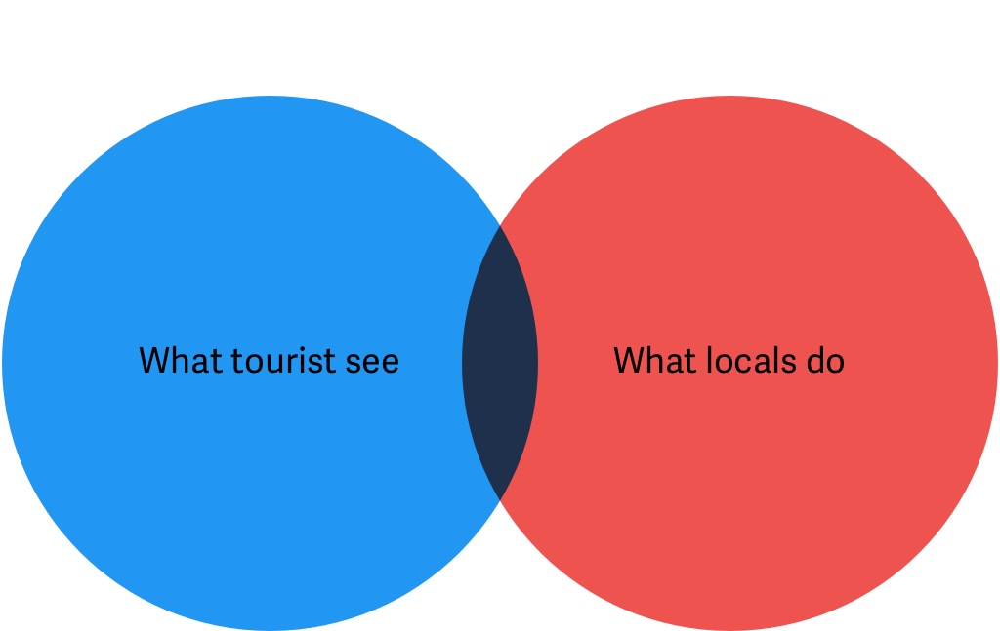
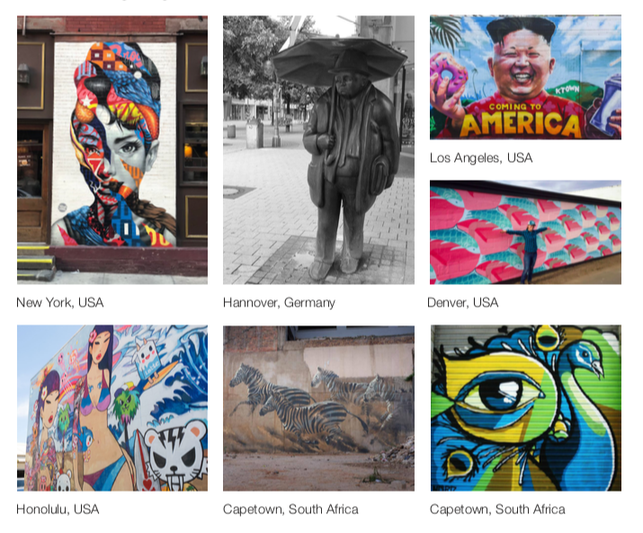

An augmented reality mobile app to learn more about culture and art while traveling.

# Role
[Anna Shambaugh](https://www.linkedin.com/in/anna-shambaugh/?lipi=urn%3Ali%3Apage%3Ad_flagship3_search_srp_top%3BDHyLxgxGQlKAmE3smEDQJw%3D%3D&licu=urn%3Ali%3Acontrol%3Ad_flagship3_search_srp_top-search_srp_result&lici=hEqIYOcPSP%2Bx23GMhJUXaQ%3D%3D) and I was involved in designing an impactful mobile app experience from start to finish. This was a personal project.   

# Context

Any laymen person would be able to tell you in an instant where the first photograph was taken. A local resident from London might say that they pass by the second photograph everyday on their morning commute to work.

It's interesting that many small locations off the beaten path go mostly unnoticed despite that fact that [London has thirty million visitors annually](http://www.uncsbrp.org/tourism.htm). This prompted a discovery phase to see if our assumptions were true. 

# Problem

People spend lots of time hovering around "tourist traps" when traveling rather than trying to experience the area from the point of view of locals. This leads people to thinking that tourist attractions fully represent the people who live in these cities. This is not to say that popular tourist attractions don't represent an area, but that there is more to a destination than just the popular places to visit.

# Background Research

We wanted to ask common travelers questions regarding where they're from and what they do when traveling. The reasoning was to validate the idea that travelers often overlook certain destinations that locals very frequently congregate behind. We discovered a generalized, but real viewpoint that could be found across potential users of our idea. 

+ Spending too much time around tourist destinations can feel constructed
+ Balance of both tourist destinations and non-tourist destinations 
+ People take pride in their community

# Defining Public Art

Public art reflects the ideas of an area and can teach people about communities and cultures around the world. This product shows others how different communities are unique.  From talking to some potential users, some wanted to expand the idea beyond art to anything a user would want to visit while traveling. 

# Audience
Our decision was to limit to scope as we wanted the app to remain focused on a specific niche.  We also were aware of other competitors in the space that currently suceessful, while looking at our idea as a way to solve the problems of a single fictional person whose needs could be clearly identified and monitored.

Such an individual is excited about different cultures. They travel often and are looking at experiencing cultures and communities different from their own. These experiences can be found in any range from large metropolitan areas to small towns.

# Persona

Jeremy Wilkes: “I feel like I’m missing out on the authentic culture of the places I travel."

Jeremy is a 24-year-old student teacher who does wedding photography for extra
income on the side. He has always had some interest in art but never decided to
pursue it as a full-time career. He tries to stay up to date with the latest trends and
technology and often keeps up through his students. To stay in touch with everyone he
always keeps his smart-phone with him, even when traveling He is also an avid user of
social media to share what he does with others. Jeremy enjoys going on road trips with
friends on weekends and during his time off. When he gets the chance he also likes
to travel abroad with his family. When Jeremy and his family travel they like to see the
tourist traps but they also leave time to do some free-form exploring.

Taking into account the goals of our persona, how he would interact with the product, 

# Interaction framework

Placeholder.

# Wireframes

Placeholder.

# Usability analysis results
We ended up testing four different individuals. From three usability tests, we could see
that our first two tasks of our interface was easy to follow. However, people were hung
up on our third task. We noticed that all of our participants were asked to look for an
item on a list, their natural response isn’t to sort first. Their natural response is to scroll.

# Changes from the results of usability analysis
Having an engaging way of seeing past visited locations is part of the experience. With
that in mind, we found that adding a sort button with a drop down to be a good way to
improve the interface. While the drop-down isn’t needed, it hides information that isn’t
needed to the interface while adding some intentional friction when users are looking to
sort. From testing our third task again, our users were able to finish the task.

# User interface design
 visual references, material design, pokemon go, thinking about how to style maps

# Final product
Placeholder for the presentation of your final solution. 

# Ethical considerations
An ethical issue that might arise in our app is that an artist may not want to have their
work discoverable on the app. Although the app is all meant to be publicly accessible
the artist may feel that it violates their usage rights as the creator of an image. Since
it is also meant to bring people to areas that they would not normally explore it may
increase tourist presence in an area that doesn’t want tourism.

# Future enhancements
In future versions, users should be able to see other user’s photos and tags within AR.
It would also be important for app’s purpose of celebrating art to have artists being
more directly involved with adding their art to the app.

# Technical requirements
The application we are proposing and developing relies heavily on augmented reality.
The technology for displaying AR through a cell phone already exist through ARKit . The aspect of the
AR that still needs improvement is the drawing in AR. People need to be able to see the
marks of others as well as add their own that everyone will be able to see. A system
has to be developed that allows shared viewing of the AR space.

# Possible constraints
It is important to consider the process of how users submit art locations to travel to.
This process can be open to all users. It could also be possible for a select few to be
able to moderate content and make sure that it is appropriate for the app. It could also
all be open for any user to be able to make any change. In the case that someone
uploads inappropriate imagery or text, there needs to be a system for reporting within
the app.

