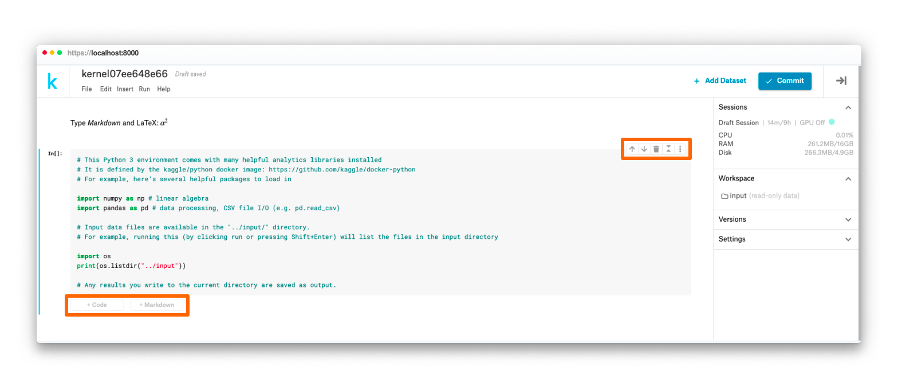
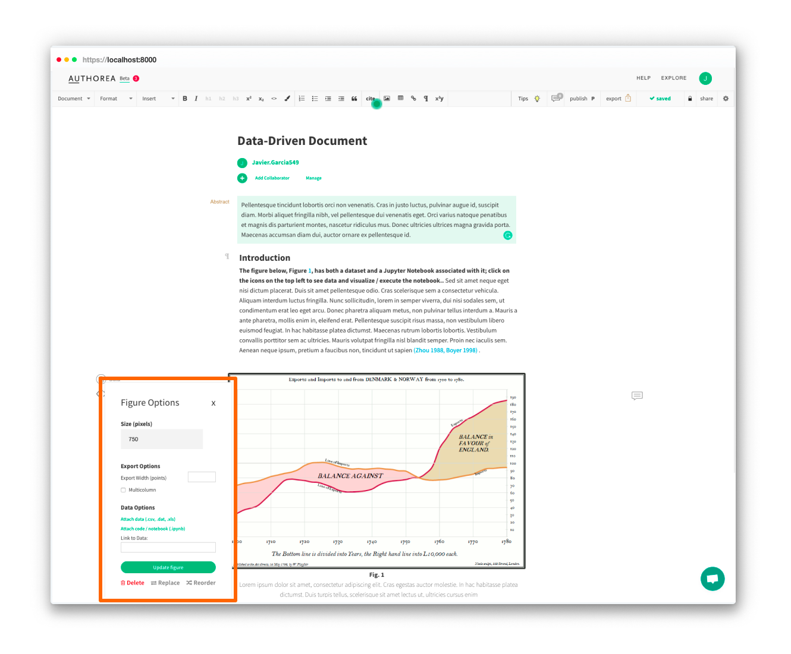
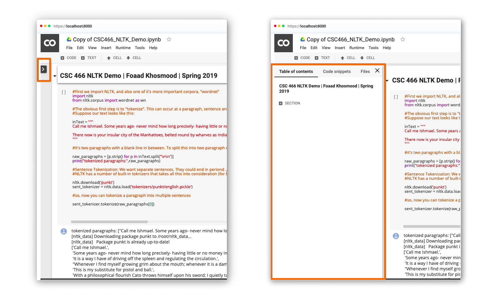

# Situation

Jupyter is an open-source project that enables the sharing of interactive code-powered “Notebooks” with others. A recent example led [Paul Romer to win the Nobel Prize in economics by using a Jupyter Notebook.](https://qz.com/1417145/economics-nobel-laureate-paul-romer-is-a-python-programming-convert/).

Jupyter has been through various evolutions since its beginning in 2014. “Classic Notebook” has existed since the start of the project. In 2018, JupyterLab was created as a virtual environment to succeed Classic Notebook.

## Roles

I worked in a team with Software Engineers Markelle Kelly and Marisa Aquilina. I frequently collaborated for Research with designer Isabela Presedo-Floyd who was on another team.

# Objective

## Problem
Many users tend to prefer Classic Notebook compared to JupyterLab. Common complaints are that JupyterLab is too complicated and difficult to use. 

## Goals
+ Uncover the social and emotional needs of users
+ Create an alterative interface using JupyterLab components that appeals to both new and established users. 

# Action

## Competitive Analysis
From looking at the market of roughly a dozen different interfaces, we saw the following trends.

## Semi-structured interviews

*Note: To follow non-disclosure agreement, I have omitted and obfuscated confidential information.*

We talked to and coded four interviews of various users familiar with the Jupyter ecosystem

### Findings
+ Expected to use JL in work, school, etc.
+ Unaware that JL and NB are different
+ View Jupyter as Python-only software
+ Use JL as a tool it's not explicitly designed for (commonly compared to an IDE)

## Jobs To Be Done

## Guerilla testing

## Eye-tracking usability studies

